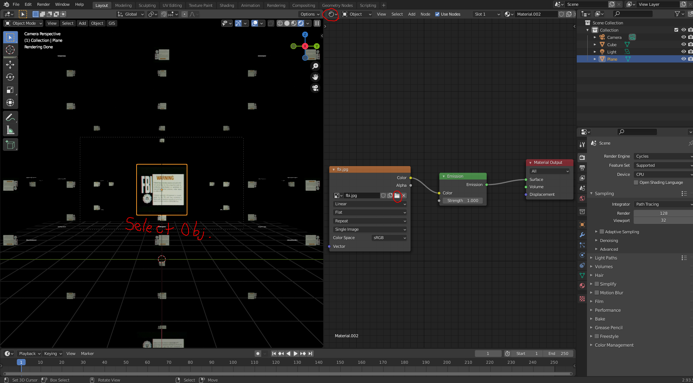

## UBCO Visual Design Club - 3d Asset Library

=================================================================

## Description

This is the UBCO Visual Design Club's 3d Asset Library. Feel free to look around and download what you like!

## Getting Started

### Dependencies

* [Blender](https://www.blender.org/download/)

### Installing

* Just simply navigate through the repository to the folder of your choice, and then hit 'download'!
Make sure to download all files associated with a particular blend file. It will contain textures that can be 
re-assigned to the proper inputs by clicking the folder icon on the image texture node within the shader node editor.

## Help

Edit this ReadMe to say what tips I should include here.

## Authors

Nathan Potter
[@eveningtelevision](https://instagram.com/eveningtelevision)

## Version History

* 0.1
    * Initial Release - Simple Library

## License

This project is licensed under the GPL-3.0 License - see the LICENSE.md file for details

## More Resources!!

Inspiration, code snippets, etc.
* [Blender Guru](https://www.youtube.com/channel/UCOKHwx1VCdgnxwbjyb9Iu1g) - Amazing free tutorials and sometimes scene files
* [Poly Haven](https://polyhaven.com/) - Free textures and Models!
* [Turbo Squid](https://turbosquid.com/) - Free textures and Models!
* [CG Trader](https://cgtrader.com/) - Free textures and Models!
* [Sketch Fab](https://sketchfab.com/) - Free textures and Models!
* [Free3D](https://free3d.com/) - Free textures and Models!
* [ArtStation](https://www.artstation.com/marketplace/game-dev/resources/3d-models) - Some free Textures and Models ($$)
* [Kitbash 3D](https://kitbash3d.com/) - High Quality Models and Textures ($$$)
