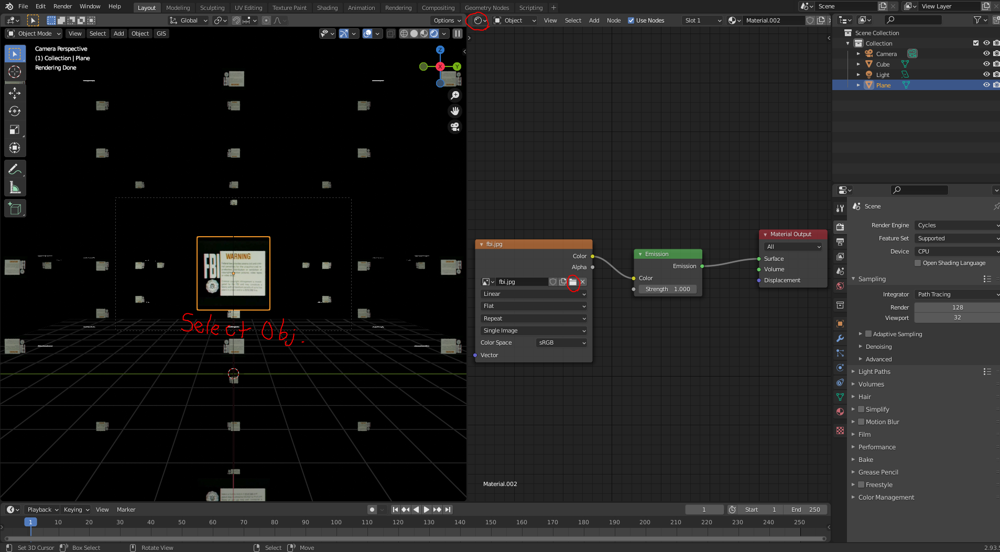
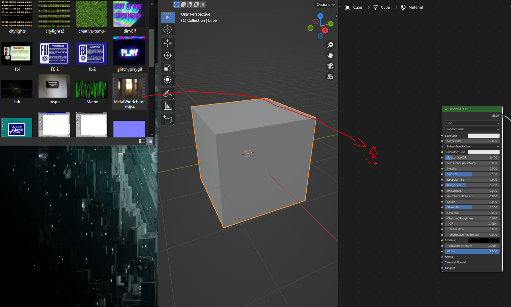
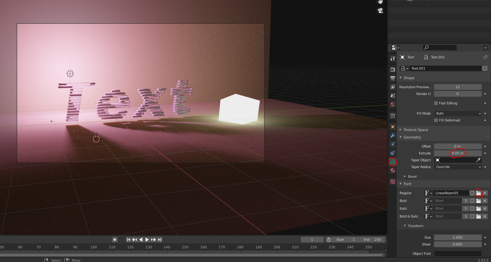
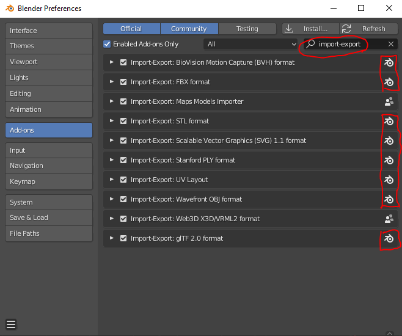
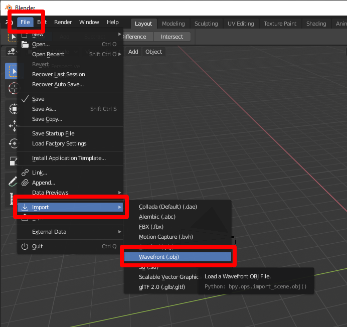

# UBCO Design Club - 3d Asset Library

## Description

Welcome to the UBCO Visual Design Club's 3d Asset Library. Feel free to look around and download what you like! All materials are listed by type within the Google Drive link - Scenes, Textures, Models, and Fonts. Jump right into a scene and start playing around, or start a fresh Blender file and import models, append materials from another blend file, or just grab certain images for image textures! Due to the size limitations that both Google and Github have, this Library is a conglomerate of many free use resources and my own personal collection of scenes, fonts, models, and textures. This library is about collaboration, so let me know if you have assets of your own that you would like to include!

## Installing

* [Blender](https://www.blender.org/download/)

## Access

Follow this link to dive into the library!

[VDC Asset Library](https://drive.google.com/drive/folders/1CVm3VxPlxeokrd2tcaQtigDPNhVr45e-?usp=sharing)

To start, just simply navigate through the G-Drive folders, choose a file and then hit 'download'! Not sure where you want to start?
Download the texttester.blend and imagetesterandmirrorbox.blend files from the Scenes folder and keep reading.

Grab some of the best assets that are free-use from these links:

* [Poly Haven](https://polyhaven.com/) - Best Quality Free Textures and Models!
* [DaFont](https://www.dafont.com/) - Wide Selection of Free Fonts that look even better in 3D.
* [Unsplash](https://unsplash.com/) - Great Textures, Inspiriation, and Reference Images

## Getting Started

Make sure to download all files associated with a particular blend file. It will contain textures that can be 
re-assigned to the proper inputs by clicking the folder icon on the image texture node within the shader node editor. 
Then, you can just navigate to the place where you want to get the image from! 

**Secret Tip**: Click and drag an image from your file machines file explorer into the Node Editor Area... Poof! It appears! Same goes for .mp4! To load image sequence in any of the supported image file formats, the filename of the images must contain a digit to indicate the frame order (e.g. 0001.jpg, 0002.jpg, 0003.jpg, etc, of any image format), indicating the frame. To make sure the video or image sequence shows up correctly, unwrap your mesh by pressing TAB -> U -> "Unwrap". Use projection for certain shapes. This can be adjusted in the UV Editor using the same controls as the mesh edit tools (G for move, C and B Select, R -> X or Y Rotate - Axis).

To convert gif's to .mp4, use: [CloudConvert](https://cloudconvert.com/gif-to-mp4)

Same goes for text! there is a 'Text Tester' blend file that you can use to test your fonts in 3d. Navigate to the 'a'
symbol in the properties pane and under fonts you can find your sizes and styling. Use extrude under geometry to give it some depth!

Appending materials is very easy. It is basically just a copy of a material from one Blend file to another. Make sure you download the blend file you want to take a material from, and from within your new file select File > Append. Make sure you are not in edit mode, as it will be greyed out. In the file explorer, double click on your blend file that you want to take from. Find the folder called materials, and choose the one you want!

[Appending Materials](https://www.youtube.com/watch?v=6Ffnoyg6oc8)

Importing models is also a rudimentary task, but you first have to change some preferences to allow you to import certain file types. Select Edit > Preferences (Edit is next to File (top left)). Choose Add-ons from the left menu, and search 'import-export'. Make sure the boxes are checked, then you can import the models you want!

## Important Resources

Here are some other amazing resources to get started in 3d! Make sure to check out the resources under Access, They are undoubtedly the best quality. Some sites may require sign-up to download files. 

* [Blender Guru](https://www.youtube.com/channel/UCOKHwx1VCdgnxwbjyb9Iu1g) - Amazing free tutorials and sometimes scene files
* [Turbo Squid](https://turbosquid.com/) - Free textures and Models!
* [CG Trader](https://cgtrader.com/) - Free textures and Models!
* [Sketch Fab](https://sketchfab.com/) - Free textures and Models!
* [Free3D](https://free3d.com/) - Free textures and Models!
* [ArtStation](https://www.artstation.com/marketplace/game-dev/resources/3d-models) - Some free Textures and Models ($$)
* [Kitbash 3D](https://kitbash3d.com/) - High Quality Models and Textures ($$$)

## Help

Find 'n8er' on the VDC Discord and message me!

## Authors

Nathan Potter
[@eveningtelevision](https://instagram.com/eveningtelevision)

## Version History

* 0.1
    * Initial Release - Simple Library; Models, Scenes, Textures, Fonts

## License

This project is licensed under the GPL-3.0 License - see the LICENSE.md file for details

